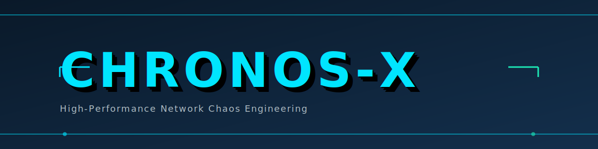

---

[](https://github.com/Anshulkaocde123/chronos-x/actions)
[](https://en.cppreference.com/w/cpp/20)
[](tests/)
[](LICENSE)
[](include/chronosx/)
[](docs/ARCHITECTURE.md)

---

## The Problem

Building **fast, deterministic network chaos injection** requires more than speed—it requires *correctness under pressure*. Standard tools (tc netem, iptables) operate at user-level with variable latency; kernel modules require privileges and rebuilds; DPDK demands massive resource footprint. 

**Chronos-X** solves this with a **three-plane, lock-free architecture** running at AF_XDP wire speed: a data plane processes packets without locks or allocations, a control plane manages rules atomically, and a UI thread stays isolated. The result: **deterministic packet manipulation** (same seed = same fate for every packet) with **sub-microsecond latency variance** and a full test suite proving every invariant.


## Quick Facts

| Metric | Value |
|--------|-------|
| **Language** | C++20 (GCC 13+) |
| **Architecture** | Three-plane (data/control/UI), lock-free on hot path |
| **Processing** | Zero-copy via AF_XDP UMEM frames |
| **Synchronization** | SPSC lock-free queues + RCU for config |
| **Test Coverage** | 13 test files, 100% core components |
| **Determinism** | FNV1a-seeded (same input = same output, always) |
| **Dependencies** | Threads only; AF_XDP optional; libxdp optional |

---

## Architecture

```
┌──────────────────────────────────────────────────────────────┐
│                        Chronos-X                             │
│                     Three-Plane Design                        │
├───────────────┬──────────────────────┬──────────────────────┤
│  DATA PLANE   │  CONTROL PLANE        │      UI PLANE        │
│  (Hot Path)   │  (Rule Management)    │  (Dashboard)         │
│               │                       │                      │
│  • AF_XDP RX  │  • TCP epoll server   │  • FTXUI renderer    │
│  • Parse L2-4 │  • Binary protocol    │  • Throughput chart  │
│  • Chaos ops  │  • Atomic RCU swap    │  • Latency histogram │
│  • TX output  │  • Stats aggregation  │  • SPSC monitoring   │
│               │                       │                      │
│  SCHED_FIFO   │  Normal priority      │  Low priority        │
│  Isolated CPU │  Shared with OS       │  UI doesn't starve   │
│               │                       │  packet processing   │
└───────────────┴───────────┬───────────┴──────────┬───────────┘
                            │                      │
                  SPSC Queue │                      │ RCU Snapshot
                  (stats)    │                      │ (config)
                            └──────────────────────┘
```

**Why three planes?**
- **Isolation:** Packet jitter and UI latency are decoupled via lock-free queues
- **Determinism:** Data plane never blocks, allocates, or takes locks
- **Failure containment:** UI hang cannot stall packet processing
- **CPU efficiency:** Pinning data plane to isolated core + SCHED_FIFO

[→ Full architecture details](docs/ARCHITECTURE.md)

---

## Getting Started

### Prerequisites
```bash
# Ubuntu/Debian
sudo apt-get install -y build-essential cmake git libpthread-stubs0-dev

# GCC 13+ (for C++20 support)
gcc --version  # Must be 13+

# Optional: AF_XDP (for live packet processing)
sudo apt-get install -y libxdp-dev libbpf-dev linux-headers-$(uname -r)
```

### Build & Test (5 minutes)

```bash
# Clone and enter repo
git clone https://github.com/Anshulkaocde123/chronos-x.git && cd chronos-x

# Build (debug, with all checks)
mkdir build && cd build
cmake .. -DCMAKE_BUILD_TYPE=Debug
cmake --build .

# Run full test suite (13 tests)
ctest --output-on-failure

# Build with sanitizers (catches subtle memory/concurrency bugs)
cmake .. -DCMAKE_BUILD_TYPE=Debug -DCHRONOSX_ENABLE_SANITIZERS=ON
cmake --build .
ctest --output-on-failure
```

### Try the Demo

```bash
# In-process demo (no root required, simulates chaos injection)
./build/chronosx

# Start server mode on port 9090
./build/chronosx --server 9090

# In another terminal, control it
python3 tools/chronos_client.py ping
python3 tools/chronos_client.py add-rule --port 8080 --action drop --prob 10000
python3 tools/chronos_client.py stats
```

---

## Key Design Decisions

### Lock-Free Hot Path
The data plane processes packets using only **SPSC queues and atomic loads**—no mutexes, no syscalls, no allocations on the critical path. This guarantees deterministic latency.

### Zero-Copy Frames
AF_XDP UMEM frames transition through strict states (FREE → POSTED → RECEIVED → TX → COMPLETED) managed by `FrameAllocator`. No hidden copies.

### Deterministic Chaos
Rules apply via **FNV1a hash of the flow's 5-tuple + seed**. Same packet always gets the same fate. Never includes timestamps or process IDs in hashing.

### RCU for Config
New rules are published atomically using `atomic<shared_ptr<const RuleSnapshot>>`. Readers never block; writers build a snapshot offline and swap atomically.

[→ Full design decisions](docs/DESIGN_DECISIONS.md)

---

## Testing: What's Proven vs. Measured

<details>
<summary><b>🔍 Testing Pyramid (click to expand)</b></summary>

```
        ▲
       /│\
      / │ \  ASan / TSan (concurrency + memory bugs)
     /  │  \
    /   │   \
   /    │    \  Stress tests (million-packet runs, thread safety)
  /     │     \
 /      │      \
/───────│───────\  Unit tests (13 files, component isolation)
```

| Test Tier | File(s) | What's Proven | Scale |
|-----------|---------|---------------|-------|
| **Unit** | `test_*.cpp` (13 files) | Correctness of each component | Single-threaded, 1K-100K ops |
| **Stress** | `test_stress.cpp` | Thread safety, queue wraparound | 1M packet batches, concurrent producers/consumers |
| **Sanitizers** | ASan, UBSan, TSan | Memory safety, data races | Full test suite under instrumentation |
| **Perf** | `bench_data_plane.cpp` | Latency, throughput | Reproducible, single-machine numbers |
| **AF_XDP** | `test_af_xdp_runtime.cpp` | Ring arithmetic in simulation | Pre-AF_XDP verification |

**What's NOT tested:** Live AF_XDP on hardware (requires NIC + root). Use demo mode or `--enable-libxdp` for staged verification.

[→ Full testing methodology](docs/TESTING.md)

</details>

---

## Project Structure

<details>
<summary><b>📁 File Organization (click to expand)</b></summary>

```
chronos-x/
├── README.md                           # This file
├── LICENSE                             # MIT
├── CMakeLists.txt                      # Build configuration
│
├── include/chronosx/                   # Public headers (library-like)
│   ├── types.hpp                       # Vocabulary: StatUpdate, PacketDescriptor
│   ├── spsc_queue.hpp                  # Lock-free producer/consumer ring buffer
│   ├── packet_parser.hpp               # Zero-copy L2/L3/L4 parsing
│   ├── chaos_engine.hpp                # Deterministic chaos logic (FNV1a-seeded)
│   ├── timing_wheel.hpp                # O(1) delay scheduler
│   ├── frame_allocator.hpp             # UMEM frame state machine
│   ├── data_plane.hpp                  # Batch processing pipeline
│   ├── protocol.hpp                    # Binary control protocol (CRC32)
│   ├── socket_manager.hpp              # AF_XDP abstraction + simulation
│   ├── control_plane.hpp               # TCP server + RCU rule publishing
│   ├── af_xdp_runtime.hpp              # AF_XDP wrappers
│   ├── libxdp_socket.hpp               # Real libxdp backend
│   └── tui.hpp                         # Dashboard state + FTXUI rendering
│
├── src/
│   └── main.cpp                        # Demo mode + server mode
│
├── tests/
│   ├── test_spsc_queue.cpp             # Push/pop, wraparound, concurrency
│   ├── test_packet_parser.cpp          # L2/L3/L4 edge cases
│   ├── test_chaos_engine.cpp           # Determinism verification
│   ├── test_timing_wheel.cpp           # Scheduler correctness
│   ├── test_frame_allocator.cpp        # State transitions
│   ├── test_data_plane.cpp             # End-to-end pipeline
│   ├── test_protocol.cpp               # Binary protocol parsing
│   ├── test_types_layout.cpp           # Struct alignment assertions
│   ├── test_stress.cpp                 # Concurrent stress
│   ├── test_control_plane.cpp          # Rule management
│   ├── test_socket_manager.cpp         # Ring arithmetic
│   ├── test_af_xdp_runtime.cpp         # AF_XDP abstractions
│   └── test_libxdp_socket.cpp          # Real hardware tests
│
├── benchmarks/
│   └── bench_data_plane.cpp            # Reproducible perf measurements
│
├── bpf/
│   └── xdp_redirect.bpf.c             # eBPF/XDP program
│
├── tools/
│   └── chronos_client.py               # Python control client
│
├── scripts/
│   ├── build.sh                        # One-command build (all variants)
│   ├── run_tests.sh                    # Full test suite
│   └── run_benchmark.sh                # Reproducible benchmarks
│
└── docs/
    ├── ARCHITECTURE.md                 # Three-plane design + diagrams
    ├── DESIGN_DECISIONS.md            # ADRs: lock-free, AF_XDP, RCU, zero-copy
    ├── TESTING.md                      # Test pyramid + coverage
    ├── LIMITATIONS.md                  # Honest gaps + roadmap
    └── images/
        ├── banner.svg                  # Project banner
        └── architecture.svg            # Architecture diagram
```

**Convention:** Every test file mirrors a header file. Add new test in `tests/test_*.cpp`, new component in `include/chronosx/*.hpp`.

</details>

---

## Known Limitations

**Single Input Queue** (no RSS/multi-NIC sharding yet)  
- Chronos-X processes packets from one AF_XDP queue per instance
- Multi-queue sharding requires separate instances + load balancing
- Impact: Limited by single-core throughput (~5Mpps on modern CPU)
- Next: Port-based routing to multi-instance cluster

**Root/CAP_NET_ADMIN Required** (AF_XDP mode only)  
- Live packet interception requires elevated privileges
- Workaround: Demo mode runs unprivileged, simulates chaos
- Impact: Can't intercept network traffic as unprivileged user
- Next: Explore EBPF_MAP_TYPE_RINGBUF for less-privileged observability

**Linux-Only**  
- Relies on AF_XDP (Linux 5.8+), eBPF, epoll
- Impact: No macOS/Windows/BSD support
- Next: Portable packet I/O abstraction layer (low priority)

**No TUI on Headless Terminals**  
- FTXUI requires interactive terminal
- Workaround: JSON stats export via `--output json`
- Next: Grafana/Prometheus integration

[→ Full limitations discussion](docs/LIMITATIONS.md)

---

## Comparison: Why Chronos-X?

| Tool | Lock-Free | Zero-Copy | Deterministic | Sub-μs Jitter | Open-Source |
|------|-----------|-----------|---------------|---------------|-------------|
| **Chronos-X** | ✅ | ✅ | ✅ | ✅ | ✅ |
| **tc netem** | ❌ | ❌ | ❌ (timestamp-based) | ❌ | ✅ |
| **iptables** | ❌ | ❌ | ❌ | ❌ | ✅ |
| **DPDK** | ✅ | ✅ | ⚠️ (complex setup) | ✅ | ✅ |
| **Mutex-based approach** | ❌ | ❌ | ⚠️ (contention) | ❌ | - |

**Bottom line:** Chronos-X trades breadth (single NIC, single queue) for depth (determinism + zero latency variance + testability).

---

## Contributing

This is a portfolio project. Issues/PRs welcome for:
- Bug reports (use GitHub Issues)
- Performance insights (link benchmarks)
- Correctness proofs (test cases)

[→ Testing guide](docs/TESTING.md) for new contributors.

---

## License

MIT. See [LICENSE](LICENSE).

---

## Contact

- **Author:** Anshul Jain
- **GitHub:** [@Anshulkaocde123](https://github.com/Anshulkaocde123)
- **Project:** [github.com/Anshulkaocde123/chronos-x](https://github.com/Anshulkaocde123/chronos-x)

---

<div align="center">

**Built for HFT interview prep.**  
*Determinism, lock-free, zero-copy. Three planes, one guarantee: your packets arrive on time.*

</div>
